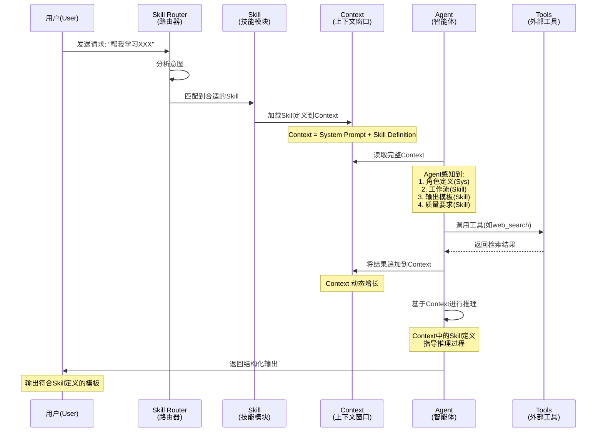

# 概念关系说明：Agent、大数据分析的上下文与 Skill

> **文档类型**: 知识关系图谱 | **生成日期**: 2026-09-04
> **涉及概念**: Agent（智能体）、大数据分析的上下文（Context）、Skill（技能模块）
> **课程关联**: 《统计与大数据分析》核心概念

---

## 📖 一、核心观点概述

**Agent、Context 和 Skill 三者构成了现代 AI 助手系统和大数据分析工具的核心架构三角**：

```
                    ┌─────────────────┐
                    │                 │
                    │    🤖 Agent     │
                    │   (行动主体)    │
                    │                 │
                    └────────┬────────┘
                             │
              ┌──────────────┼──────────────┐
              │              │              │
              ▼              ▼              ▼
    ┌─────────────────┐ ┌─────────────┐ ┌─────────────┐
    │                 │ │             │ │             │
    │  📚 Skill       │ │🧠 Context  │ │  (其他组件)  │
    │  (能力模块)     │ │ (工作记忆)  │ │ Memory等    │
    │                 │ │             │ │             │
    └─────────────────┘ └─────────────┘ └─────────────┘
```

### 一句话总结三者关系：

> **Agent 是自主行动的"大脑"，Context 是它当前"正在思考的内容"，而 Skill 是它掌握的"专业技能"。Agent 通过 Context 感知环境并做出决策，通过 Skill 调用结构化的能力来完成任务。**

---

## 🔍 二、两两关系详解

### 2.1 Agent ↔ Context：上下文如何影响 Agent 的工作

#### 核心机制

**Context 是 Agent 的"感知窗口"和"工作记忆"**，直接决定了 Agent 能看到什么、记住什么、以及如何决策。

```
┌─────────────────────────────────────────────────────────────┐
│                    Agent 工作循环                            │
│                                                             │
│   ┌─────────┐                                               │
│   │  环境    │ ←── Agent 通过传感器/输入接口感知环境          │
│   │(真实世界)│                                              │
│   └────┬────┘                                               │
│        │ 感知数据                                             │
│        ▼                                                     │
│   ╔═════════════════════════════════════════════════════╗     │
│   ║              Context Window (上下文窗口)               ║     │
│   ║  ┌─────────────────────────────────────────────┐   ║     │
│   ║  │ [System Prompt] 你是一个数据分析助手...      │   ║     │
│   ║  ├─────────────────────────────────────────────┤   ║     │
│   ║  │ [History] 用户: 分析这个数据集               │   ║     │
│   ║  │           Agent: 好的，我发现...            │   ║     │
│   ║  │           用户: 重点看异常值                │   ║     │
│   ║  ├─────────────────────────────────────────────┤   ║     │
│   ║  │ [Retrieved Knowledge] 异常值检测方法...      │   ║     │
│   ║  ├─────────────────────────────────────────────┤   ║     │
│   ║  │ [Current Input] 请用箱线图展示异常值分布    │   ║     │
│   ║  └─────────────────────────────────────────────┘   ║     │
│   ╚═════════════════════════════════════════════════════╝     │
│        │                                                     │
│        ▼                                                     │
│   ┌─────────┐    Context 决定了 Agent 的：                   │
│   │ 推理引擎  │    • 能"看到"什么信息                          │
│   │(LLM/ML) │    • "记得"之前的哪些对话                       │
│   └────┬────┘    • 拥有哪些背景知识                           │
│        │         • 受到什么行为约束                           │
│        ▼                                                     │
│   ┌─────────┐                                               │
│   │  行动    │ ←── Agent 的输出受 Context 中所有信息影响     │
│   │(执行器)  │                                               │
│   └─────────┘                                               │
│                                                             │
└─────────────────────────────────────────────────────────────┘
```

#### Context 对 Agent 的5大影响

| 影响维度 | 具体表现 | 示例 |
|---------|---------|------|
| **1. 感知范围** | Context 决定了 Agent 能获取多少环境信息 | Context 包含历史对话 → Agent 知道用户之前问过什么 |
| **2. 决策质量** | 信息越完整、相关度越高，决策越准确 | Context 提供了领域知识 → Agent 给出专业回答而非泛泛而谈 |
| **3. 行为一致性** | System Prompt 约束 Agent 的角色和行为风格 | Context 设定"你是严谨的统计学家" → Agent 避免口语化表达 |
| **4. 记忆连续性** | 对话历史使 Agent 能维持长期对话的连贯性 | Context 记住用户偏好 → 后续回复自动适配 |
| **5. 能力边界** | 可用工具和知识的定义限制了 Agent 的能力范围 | Context 列出可用工具 → Agent 只能调用这些工具 |

#### 关键挑战："Lost in the Middle"现象

**研究发现**（Liu et al., 2023）：当 Context 很长时，Agent 对**中间部分**的信息关注度显著降低，更倾向于关注开头和结尾。

**对 Agent 的影响**：
- ⚠️ 可能忽略重要的中间指令或约束
- ⚠️ 长对话中可能"忘记"中间讨论过的关键信息
- ⚠️ 多文档检索时，排名靠后的文档容易被忽视

**解决方案**：
1. **重要信息前置/后置**: 将关键指令放在 Context 的开头或结尾
2. **显式引用**: 在当前输入中明确提及之前的重要信息
3. **分层摘要**: 将长历史压缩为结构化摘要
4. **注意力机制优化**: 使用改进的模型架构（如Longformer）

---

### 2.2 Agent ↔ Skill：Skill 如何沉淀可复用的任务知识

#### 核心机制

**Skill 是 Agent 的"技能包"，将专家经验沉淀为可复用、可执行的结构化知识。**

```
┌─────────────────────────────────────────────────────────────┐
│                  Skill 的价值链                              │
│                                                             │
│   专家经验                                                    │
│   (隐性知识)                                                 │
│      │                                                      │
│      ▼                                                      │
│   ┌──────────────────────────────────────────────────┐      │
│   │           Skill 定义过程                           │      │
│   │                                                   │      │
│   │   ① 提取最佳实践 → ② 标准化流程                   │      │
│   │   ③ 定义输入/输出 → ④ 编写质量检查               │      │
│   │   ⑤ 测试验证 → ⑥ 版本发布                        │      │
│   │                                                   │      │
│   └──────────────────────────────────────────────────┘      │
│      │                                                      │
│      ▼                                                      │
│   结构化知识 (显性知识)                                      │
│      │                                                      │
│      ├──→ 被多个 Agent 复用                                 │
│      ├──→ 被不同用户共享                                     │
│      ├──→ 持续迭代优化                                       │
│      └──→ 形成组织资产                                      │
│                                                             │
└─────────────────────────────────────────────────────────────┘
```

#### Skill 如何增强 Agent 的能力

| 维度 | 没有 Skill 的 Agent | 有 Skill 的 Agent |
|------|---------------------|------------------|
| **任务理解** | 每次都要猜测用户意图 | Skill 明确定义触发条件，自动匹配 |
| **执行质量** | 依赖模型的通用能力 | Skill 封装了领域最佳实践 |
| **输出一致性** | 格式随意，不可预测 | Skill 强制标准化的输出模板 |
| **可追溯性** | 不知道模型为什么这么做 | Skill 记录了完整的推理步骤 |
| **可复用性** | 相似任务需要重复提示 | 一次定义，无限次调用 |
| **可维护性** | 改进需要修改 Prompt | 更新 Skill 定义即可全局生效 |
| **团队协作** | 个人经验难以传承 | Skill 可以在团队间共享 |

#### 实际案例：从"一次性Prompt"到"可复用Skill"

**阶段1：临时 Prompt（无Skill）**
```
用户每次都需要详细描述需求：
"请帮我分析这个CSV文件，计算均值、中位数、标准差，
然后画直方图和箱线图，找出异常值，最后写一段结论。
用Python代码实现。"
```
❌ 问题：冗长、易遗漏步骤、格式不一致

**阶段2：创建 Skill（知识沉淀）**
```yaml
# SKILL.md: data-analysis-skill
name: 数据分析助手
trigger:
  - "分析数据"
  - "统计分析"
  - "数据可视化"

workflow:
  1. 读取数据并预览
  2. 计算描述性统计量
  3. 检测缺失值和异常值
  4. 生成可视化图表
  5. 撰写分析报告

output_template:
  ## 数据概览
  ## 统计描述
  ## 可视化分析
  ## 异常值检测
  ## 结论与建议
```
✅ 优势：简洁、一致、可复用

**阶段3：Agent 调用 Skill**
```
用户: "帮我分析 sales_2024.csv"

系统:
1. 匹配到 Skill: data-analysis-skill ✅
2. 加载 Skill 定义和工作流
3. 自动执行8个步骤
4. 输出标准化报告
```

---

### 2.3 Context ↔ Skill：Skill 定义如何塑造 Context

#### 核心机制

**Skill 的定义内容会成为 Context 的一部分，直接影响 Agent 的行为和输出质量。**

```
Context 的组成：

┌────────────────────────────────────────────────────┐
│                  Complete Context                    │
│                                                    │
│  Layer 0: System Prompt (基础框架)                 │
│  ┌──────────────────────────────────────────────┐  │
│  │ You are a helpful AI assistant.              │  │
│  │ Always be concise and accurate.              │  │
│  └──────────────────────────────────────────────┘  │
│                                                    │
│  Layer 1: ★ Skill Definition ★ (能力注入)        │  │  ← Skill 在这里发挥作用！
│  ┌──────────────────────────────────────────────┐  │
│  │ # Skill: concept-learning-generator          │  │
│  │ Trigger: "学习XXX", "解释XXX"               │  │
│  │ Workflow: 8个步骤                            │  │
│  │ Output Template: 7个章节                     │  │
│  │ Quality Checks: 8项自检                      │  │
│  │ Tools: web_search, code_interpreter          │  │
│  └──────────────────────────────────────────────┘  │
│                                                    │
│  Layer 2: Conversation History (对话历史)          │
│  ┌──────────────────────────────────────────────┐  │
│  │ User: 帮我学习Agent                          │  │
│  │ Agent: 好的，这是关于Agent的学习资料...       │  │
│  └──────────────────────────────────────────────┘  │
│                                                    │
│  Layer 3: Retrieved Knowledge (检索知识)           │
│  ┌──────────────────────────────────────────────┐  │
│  │ [From Wikipedia] Agent is an entity that...  │  │
│  │ [From Textbook] Russell & Norvig define...   │  │
│  └──────────────────────────────────────────────┘  │
│                                                    │
│  Layer 4: Current Input (当前输入)                 │
│  ┌──────────────────────────────────────────────┐  │
│  │ User: 接下来学习大数据分析的上下文           │  │
│  └──────────────────────────────────────────────┘  │
│                                                    │
└────────────────────────────────────────────────────┘
```

#### Skill 对 Context 的影响

| 影响方面 | 说明 | 示例 |
|---------|------|------|
| **Context 结构** | Skill 定义了 Context 应该如何组织 | Skill 要求7章节输出 → Context 中包含模板指引 |
| **Context 内容** | Skill 决定需要检索哪些知识 | Skill 指定需要"权威来源" → Context 包含学术论文片段 |
| **Context 长度** | Skill 的复杂度影响 Context 大小 | 简单 Skill: ~500 tokens；复杂 Skill: ~3000 tokens |
| **工具调用** | Skill 声明的工具会出现在 Context 中 | Skill 需要 web_search → Context 包含搜索结果 |
| **质量约束** | Skill 的自检要求成为 Context 的一部分 | Skill 要求"必须有来源链接" → Agent 在 Context 中查找引用 |

---

## 🗺️ 三、三者的协同工作流（Mermaid 图）

### 3.1 完整交互流程



### 3.2 架构层次图

```mermaid
graph TB
    subgraph "User Interface"
        UI[用户请求]
    end

    subgraph "Routing Layer"
        SR[Skill Router<br>意图识别]
    end

    subgraph "Skill Layer"
        SK[Skill Definition<br>SKILL.md]
        WF[Workflow<br>工作流程]
        OT[Output Template<br>输出模板]
        QC[Quality Checks<br>质量检查]
    end

    subgraph "Context Layer"
        SP[System Prompt]
        SD[Skill Definition<br>(来自Skill)]
        CH[Conversation History]
        RK[Retrieved Knowledge]
        CI[Current Input]
    end

    subgraph "Agent Layer"
        AG[Agent Core<br>推理引擎]
        ME[Memory<br>长期记忆]
    end

    subgraph "Tool Layer"
        TL[Tools/APIs<br>外部服务]
    end

    UI --> SR
    SR --> |"匹配"| SK
    SK --> WF & OT & QC
    WF & OT & QC --> |"注入"| SD
    SD --> Ctx[Context Window]
    SP & CH & RK & CI --> Ctx
    Ctx --> AG
    AG --> TL
    TL --> |"结果返回"| AG
    AG --> ME
    ME --> |"历史经验"| Ctx

    style SK fill:#e1f5fe
    style Ctx fill:#fff3e0
    style AG fill:#f3e5f5
    style TL fill:#e8f5e9
```

---

## 📊 四、对比总结表

### 4.1 三概念核心属性对比

| 属性 | Agent | Context（上下文） | Skill |
|------|-------|-------------|-------|
| **本质** | 自主行动的主体 | 工作记忆/感知窗口 | 可复用的能力模块 |
| **生命周期** | 持续运行（会话级） | 单次请求内（临时） | 持久存储（文件级） |
| **主要职责** | 感知、推理、决策、行动 | 提供信息和约束 | 定义流程和规范 |
| **设计哲学** | 目标导向、自适应 | 信息完整、相关 | 标准化、可复用 |
| **技术实现** | 架构模式（ReAct/Plan-and-Solve） | Token序列拼接 | YAML/Markdown定义文件 |
| **度量指标** | 任务成功率、用户满意度 | Token效率、信息密度 | 复用频率、质量评分 |
| **类比** | 员工/专家 | 工作台/草稿纸 | SOP/操作手册 |

### 4.2 相互作用矩阵

|  | Agent | Context | Skill |
|--|-------|---------|-------|
| **Agent** | - | Agent **消费** Context 来做决策 | Agent **调用** Skill 来获得能力 |
| **Context** | Context **约束** Agent 的行为 | - | Skill **定义** 注入 Context |
| **Skill** | Skill **增强** Agent 的能力 | Skill **塑造** Context 的结构 | - |

---

## 💡 五、深度洞察：两个关键问题

### 5.1 问题一：上下文如何影响 Agent 的工作？

**答案：Context 是 Agent 决策的唯一信息来源，其质量和结构直接决定了 Agent 的表现上限。**

#### 详细解析：

**1. 信息完整性 → 决策准确性**
```
Context 完整（包含相关背景知识）
    ↓
Agent 能全面理解问题
    ↓
给出准确、有深度的回答

vs.

Context 缺失（缺少关键背景）
    ↓
Agent 只能基于有限信息猜测
    ↓
可能出现幻觉或表面化回答
```

**2. 信息位置 → 注意力分配**
```
重要信息在 Context 开头/结尾
    ↓
Agent 高度关注（U型注意力曲线）
    ↓
正确理解和执行

vs.

重要信息在 Context 中间
    ↓
Agent 可能忽略（Lost in the Middle）
    ↓
遗漏关键要求或约束
```

**3. 信息噪声 → 干扰程度**
```
Context 简洁、相关
    ↓
Agent 快速聚焦核心任务
    ↓
高效、准确的输出

vs.

Context 冗余、杂乱
    ↓
Agent 被无关信息干扰
    ↓
响应变慢、质量下降
```

**实践建议**：
- ✅ 将最重要的指令放在 Context 的开头或结尾
- ✅ 使用结构化格式（列表、表格）而非纯文本
- ✅ 定期清理过时的历史对话
- ✅ 显式引用之前的关键信息
- ❌ 避免在 Context 中堆砌大量不相关的文档

---

### 5.2 问题二：Skill 如何沉淀可复用的任务知识？

**答案：Skill 通过"结构化封装"将隐性的专家经验转化为显性的、可执行的知识资产，实现知识的积累、共享和进化。**

#### 知识沉淀的生命周期：

```
阶段1: 隐性知识（存在于专家脑中）
┌─────────────────────────────────────┐
│ 专家凭直觉和经验完成任务             │
│ "我做数据分析时通常会先看分布..."    │
│ （难以言传、因人而异）               │
└─────────────────────────────────────┘
        ↓ 提取与形式化
阶段2: 显性知识（记录在 Skill 中）
┌─────────────────────────────────────┐
│ # Skill: data-exploration          │
│ workflow:                          │
│   1. 数据概览 (df.head, df.info)  │
│   2. 分布分析 (hist, boxplot)      │
│   3. 相关性分析 (corr matrix)      │
│   ...                              │
│ （标准化、可执行）                  │
└─────────────────────────────────────┘
        ↓ 共享与复用
阶段3: 组织资产（被多人使用）
┌─────────────────────────────────────┐
│ 👤 User A: 调用 Skill → 得到报告A  │
│ 👤 User B: 调用 Skill → 得到报告B  │
│ 👤 User C: 调用 Skill → 得到报告C  │
│ （一致性高、质量稳定）              │
└─────────────────────────────────────┘
        ↓ 反馈与迭代
阶段4: 进化知识（持续优化）
┌─────────────────────────────────────┐
│ 收集反馈: "第3步应该加异常值检测"   │
│ 更新 Skill: 新增 Step 2.5          │
│ 版本: v1.0 → v1.1                 │
│ （越来越好）                       │
└─────────────────────────────────────┘
```

#### Skill vs 传统知识管理方式：

| 维度 | 文档/Wiki | 代码库 | Skill |
|------|----------|--------|-------|
| **形式** | 静态文本 | 可执行但需编程 | 半结构化+可执行 |
| **使用门槛** | 低（阅读） | 高（需开发） | 中（自然语言+结构） |
| **自动化程度** | 无 | 完全自动 | 半自动（AI辅助） |
| **灵活性** | 高（自由发挥） | 低（严格逻辑） | 中（有框架但有弹性） |
| **适用场景** | 学习参考 | 固定流程 | AI辅助的任务完成 |

---

## 🎯 六、实际应用建议

### 6.1 对于开发者/构建者

1. **设计 Skill 时考虑 Context 效率**
   - Skill 定义应精简（< 1000 tokens）
   - 详细文档放在外部链接
   - 避免在 Skill 中嵌入大量示例

2. **为 Agent 设计合理的 Context 管理策略**
   - 设置最大 Context 长度限制
   - 实现自动摘要和压缩机制
   - 重要信息重复提醒

3. **建立 Skill 生命周期管理**
   - 版本控制（v1.0, v1.1, v2.0）
   - 使用统计（调用频率、成功率）
   - 定期审核和更新

### 6.2 对于使用者/终端用户

1. **提供清晰的初始 Context**
   - 明确说明你的角色期望
   - 提供必要的背景信息
   - 设定输出格式要求

2. **善用 Skill 而非重复描述**
   - 选择合适的 Skill 而非每次都详细说明需求
   - 如果现有 Skill 不满足，考虑贡献新的 Skill

3. **监控 Context 使用情况**
   - 注意对话长度（避免超出限制）
   - 重要信息主动重申
   - 及时开启新会话（当话题转换时）

---

## 📚 七、参考资料

1. **Russell, S., & Norvig, P. (2020). *Artificial Intelligence: A Modern Approach* (4th ed.)**
   - Chapter 2: Intelligent Agents - Agent的形式化定义

2. **Liu, N., et al. (2023). "Lost in the Middle: How Language Models Use Long Contexts."**
   - 关于Context中注意力分布的关键研究

3. **WorkBuddy Documentation - Skills**
   - https://docs.workbuddy.cn/skills - Skill系统的设计和使用

4. **OpenAI Platform - Assistants API**
   - https://platform.openai.com/docs/assistants - Context和Tool的实际应用

5. **Wang, X., et al. (2023). "Survey on Large Language Model-based Agents."**
   - Agent架构的综合综述

---

**文档版本**: 1.0
**最后更新**: 2026-09-04
**关联文档**: agent.md | llm-context.md | skill.md
